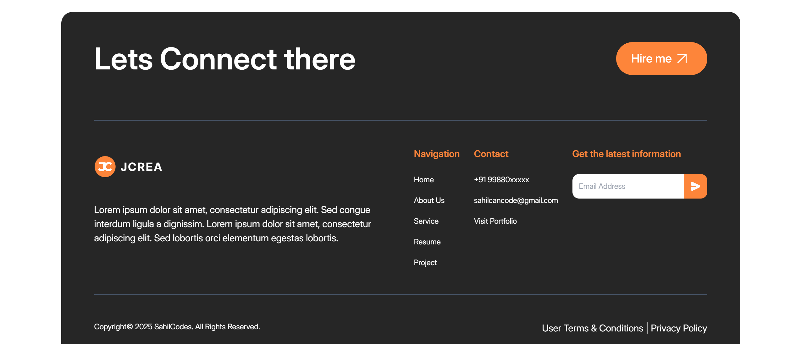

# HTML/CSS/Tailwind Portfolio Project

### How To Use

 Open up your terminal and run these commands.
```
 cd '<Project Folder>'
```
```
 npm install
```
```
 npm run css
```

And you are good to go.

### Error Handling
If at any point you come across some errors, probably while trying to edit something in the **tailwind.config.js** file, you should head over to your terminal and type `npm run css` again or type `npx tailwindcss -i ./src/input.css -o ./public/assets/css/output.css --minify --watch` depending on your choice.


### Preview





